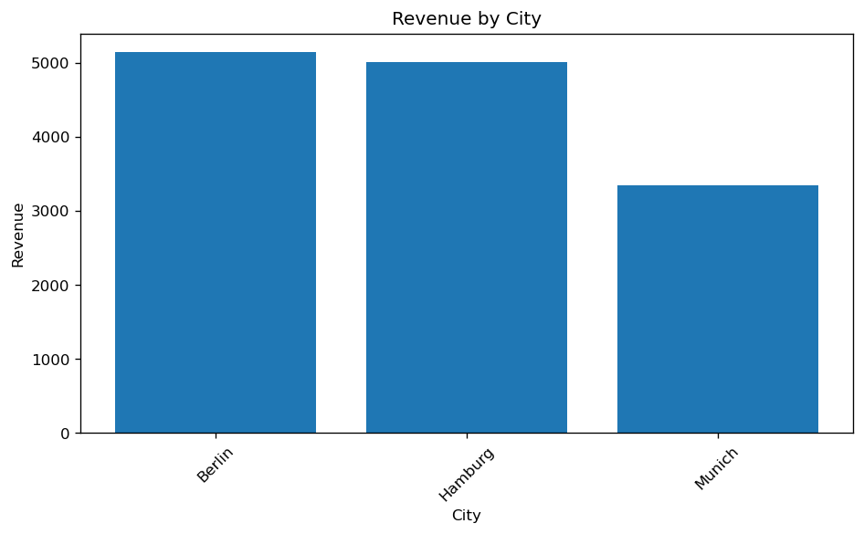

# Retail Store SQL Analysis

## Overview
End-to-end SQL business analysis of a retail store
database with 3 tables — customers, products, and
orders. Answered 7 business questions and built
5 professional visualisations using Python and
Matplotlib.

## Project Structure
## Business Questions Answered
1. Which product category generates most revenue?
2. What is the monthly revenue trend?
3. Which city has the highest spending customers?
4. Who are the top 5 customers by spending?
5. Which products sell the most?
6. What is the average order value?
7. How does revenue compare across cities?

## Key Findings
- Electronics generates the highest revenue
- Hamburg is the top spending city
- Laptop Pro is the best selling product
- Revenue shows consistent growth trend
- Top customer spent 3x the average

## Database Structure
| Table | Records | Description |
|-------|---------|-------------|
| customers | 12 | Customer details |
| products | 10 | Product catalog |
| orders | 25 | Sales transactions |



## SQL Skills Demonstrated
```sql
-- Complex JOIN across 3 tables
SELECT c.name, SUM(p.price * o.quantity) AS total_spent
FROM orders o
JOIN customers c ON o.customer_id = c.customer_id
JOIN products p  ON o.product_id  = p.product_id
GROUP BY c.name
ORDER BY total_spent DESC
LIMIT 3;
```

## Visualisations
| Chart | Description |
|-------|-------------|
| Category Revenue | Bar chart by product category |
| Monthly Trend | Line chart with area fill |
| City Revenue | Horizontal bar chart |
| Top Customers | Bar chart by spending |
| Dashboard | All 4 charts combined |

## Tools Used
- Python 3.11
- SQLite (database)
- Pandas (data analysis)
- Matplotlib & Seaborn (visualisation)
- VS Code
```

## About Me
QA Automation Engineer → Junior Data Analyst
Python | SQL | Pandas | Tableau | TensorFlow
Based in Braunschweig, Germany 🇩🇪

[](https://github.com/bhavana-bordekar)
[Retail Store Analytics Dashboard](https://public.tableau.com/app/profile/bhavana.bordekar)
